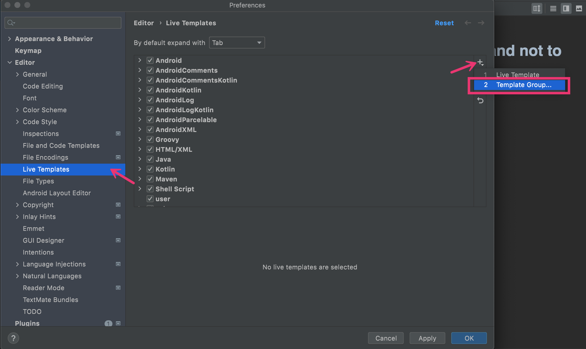
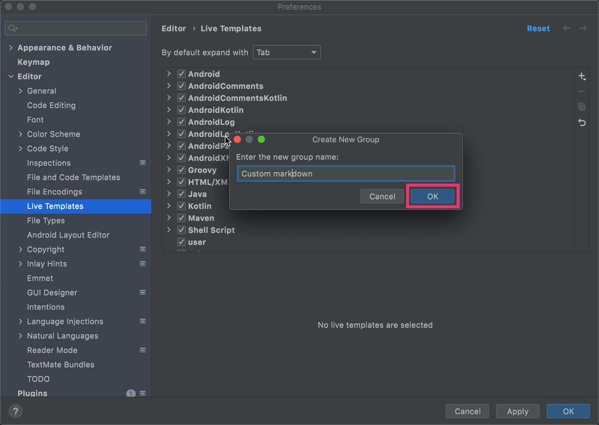
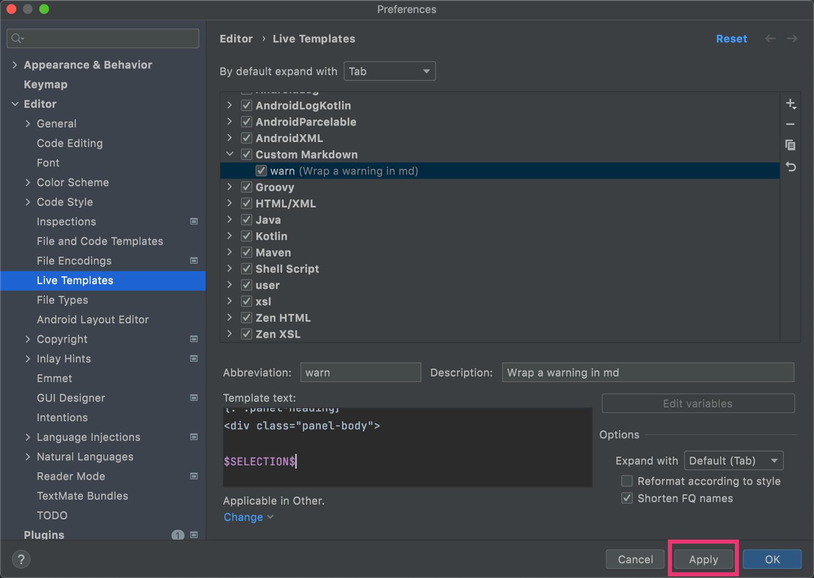
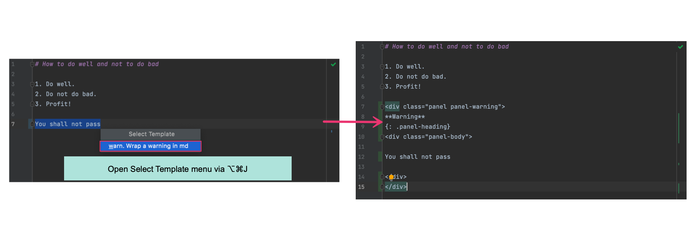

# Reuse the repeating fragments

Imagine you are typing the same content again and again, it
can be a custom lightweight markup element, a repeating fragment, like an 
admonition block, for example, a warning, or an HTML code.

The live template is a function that allows you to type a few letters and insert longer fragments into your document. It makes it easier for you to insert
repeating patterns into the text.

In this tutorial, you will create and reuse the live template while making a
new document. This flow will apply to any markup language or static site generator.

## Table of contents

* [Create a live template](#create-a-live-template)
* [Use a Live Template](#use-a-live-template)

## Create a Live template

For example, in this tutorial, we will create a template for a custom 
Markdown element that you may use in your chosen Markdown flavor or a static 
site generator.

It can look like this:
````
<div class="panel panel-warning">
**Warning**
{: .panel-heading}
<div class="panel-body">

WARNING CONTENT

</div>
</div>
````

To create a live template and surround your text with this fragment:
1. Open IDE Preferences and go to the **Editor | Live Templates** section.
2. Select an existing or create a new template group to put your template into.
3. To create a new group, click **+** on the right of the panel and select 
   **Template group**.

4. Type the group name. In our case, we called it `Custom Markdown`. Click 
   **OK**.

5. Select this group in the list and click **+**. Select **Live Template**.

6. Specify the abbreviation — it will be a shortcut used to invoke the template. It can contain Latin letters,
   numbers, dots, and hyphens. For example: `warn`. It should be unique 
   within a group.
7. You can fill the **Description** field — write in which cases this 
   template is intended to be used. For example: `Use it to wrap a warning 
   block`.
8. In the **Template text** field, add the template content that will be
   inserted in the document later.
9. Put the **$SELECTION$** variable to the place where the fragment to be 
   wrapped will be. It will appear in the **Surround With** menu.
10. Define the context where the template will be used — you can pick **Other**
    for Markdown.
11. Apply your changes.

If you don't select a template group, the live template will be added to the user group by default. You can change it later.

Get to know other ways to [create live templates](https://www.jetbrains.com/help/idea/creating-and-editing-live-templates.html).

In the example below, we used the **$SELECTION$** variable. Get to know other 
variables in [Live template variables section](https://www.jetbrains.com/help/idea/template-variables.html).

## Use a Live Template

From now on, you can use the Live template on the go.

Select the fragment you need to surround with the markup. Type **⌥⌘J**. In 
the **Select Template** menu, select the abbreviation. It will wrap the 
selected text as specified in the template.


