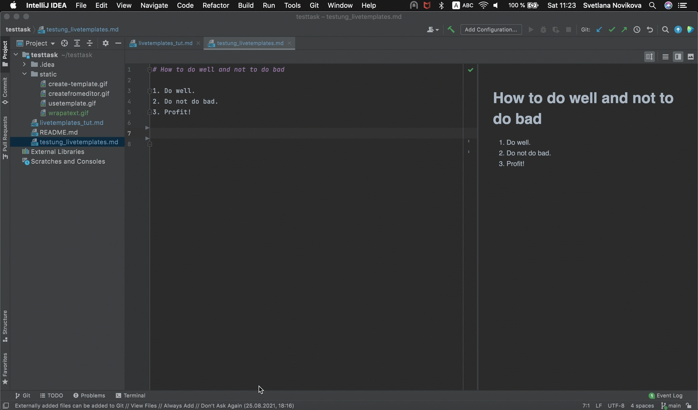
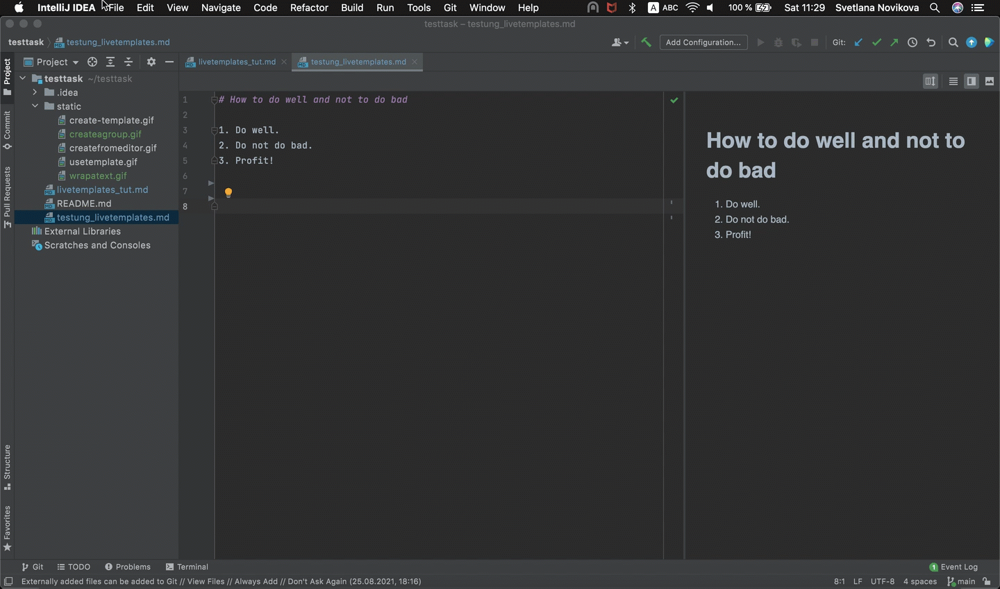
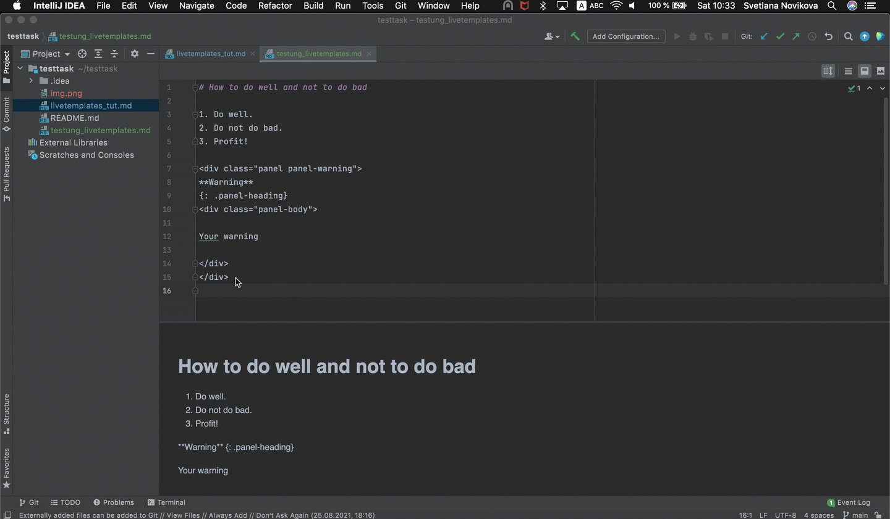
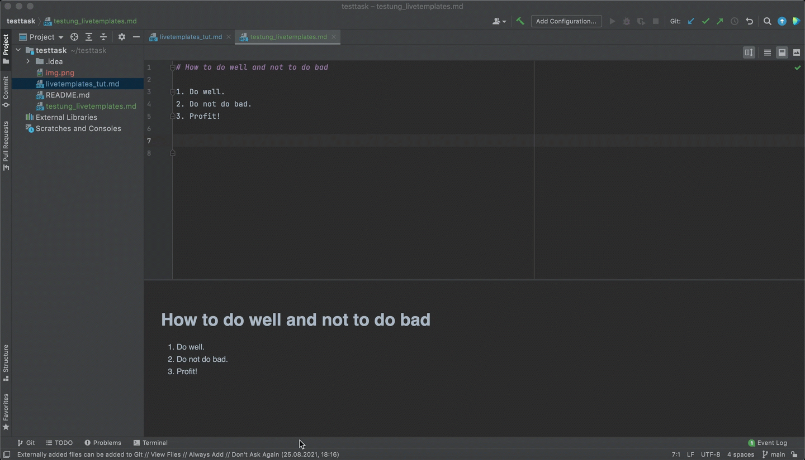
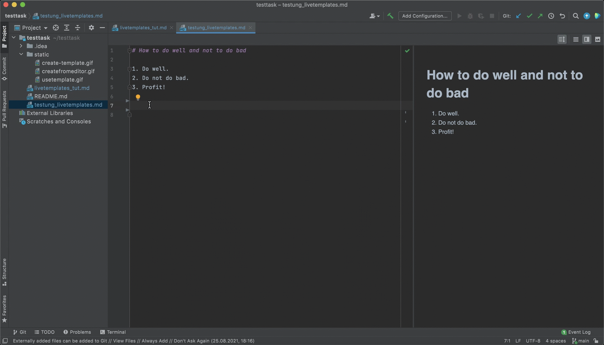

# What are Live templates and when to use them

Imagine you are typing the same content again and again, it
can be a custom lightweight markup element or a repeating fragment, like
warning or admonition block, or an HTML code.

Live templates function makes it easier to you to insert repeating patterns
into the text.

## Create a Live template

### Create from scratch

For example, you need to create a template for a custom Markdown element
that you use in your chosen Markdown flavor or static site generator.

It can look like this:

````
<div class="panel panel-warning">
**Warning**
{: .panel-heading}
<div class="panel-body">

WARNING CONTENT

</div>
</div>
````

To create a live template and surround your text with this fragment:
1. Open IDE Preferences and go to the **Editor | Live Templates** section.
2. Select or create a template group to put your template into.
3. To create a new group click + on the right of the panel, select **Template
   group**, and type the group name. In our case, it will be Custom Markdown.



4. Select this group in the list and click +. Select **Live
   Template**.
5. Specify the abbreviation — it will be a shortcut used to invoke it. It can contain an abbreviation that consists of Latin letters,
   numbers, dots, and hyphens. For example: warn. It should be unique within a group.
6. Optionally, fill the **Description** field, you can write in which cases to use this template. For example: Use it to wrap a warning block.
7. In the **Template text** field add the template content that will be
   inserted in the document later.
8. Put the **$SELECTION$** variable in the place of the text fragment to be 
   wrapped. That way it will appear in the **Surround With** menu.
9. Define the context where the template will be used — you can pick Other
   for markdown.
10. Apply your changes.



If you don't select a template group, the live template will be added to the user group by default. You can change it later.

### Transform a markup fragment into a template

You also can create a template inside an editor if you've already typed your
text fragment there.

1. Select this fragment.
2. In the top menu select **Code | Save as Live Template...** option.
3. Choose which group to save the template and specify the abbreviation.
4. Optionally write the description or make changes in the template content.
5. Click **OK** to apply the changes.



## Use a Live Template

From now, you can use the Live template on the go.

There are two ways to do this:
1. Type the abbreviation you've set for the template and press Tab. The template will be inserted into the document.



2. Select the fragment you need to surround with the markup. Type **⌥⌘J**. 
   In the Surround With menu select the abbreviation. It will wrap the 
   selected text as specified in the template.


